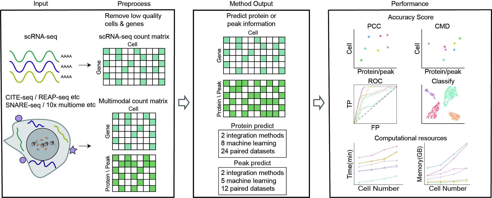

# Benchmarking algorithms for predicting protein abundance and chromatin accessibility from single-cell transcriptomics

## Implementation description

  we collected twenty-four RNA+Protein multiomics datasets generated by CITE-seq and REAP-seq, ten RNA+ATAC multiomics datasets generated by 5 single-cell multiomics sequencing technologies (10x Multiome, SNARE-seq, Paired-seq, SHARE-seq, and ISSAAC-seq), and two RNA+ATAC+Protein single-cell multiomics dataset obtained by DOGMA-seq to 1) systematically evaluate the performance of 12 algorithms for predicting protein abundance or chromatin accessibility from using gene expression. 2) We also explore the impact of batch effects on the accuracy of these algorithms. 3）Finally, we evaluate the computational resources consumed by each method.

  We provide example guidance to help researchers choose an appropriate algorithm for their datasets,
  the code files located in 'code/RNA2Protein/methods' and 'code/RNA2ATAC/methods' are examples showing how to use them to predict protein abundance or chromatin accessibility from gene expression.

## Dependencies and requirements for Predicting protein abundance or chromatin accessibility information of cells in scRNA-seq data

 Before you run the pipeline, please make sure that you have installed and python3, R(4.1) and all the 12 packages(totalVI, scArches, cTP-net, Babel, CMAE, sciPENN, Guanlab-dengkw, scMoGCN, MultiVi, LS_Lab, Seurat and LIGER) :
1. Before the installation of these packages, please install Miniconda to manage all needed software and dependencies. You can download Miniconda from https://conda.io/miniconda.html.
2. Download MultiomeBenchmarking.zip from https://github.com/QuKunLab/MultiomeBenchmarking. Unzipping this package and you will see Benchmarkingenvironment.yml and Config.env.sh located in its folder.
3. Build isolated environment for MultiomeBenchmarking: 
`conda env create -f Benchmarkingenvironment.yml`
4. Activate Benchmarking environment:
`conda activate Benchmarking`
5. `sh Config.env.sh`
6. Enter R and install required packages by command : `install.packages(c('vctrs','rlang','htmlwidgets'))`

Installation of Benchmarking may take about 7-15 minutes to install the dependencies.

### Predicting protein abundance of cells in scRNA-seq

1. Dependencies and requirements

    Before you run the pipeline, please make sure that you have installed and python3, R and all the ten packages: totalVI(Version 0.6a0), scArches(Version 0.6a0), cTP-net(Version 0.6a0), Babel(Version 0.6a0), CMAE(Version 0.6a0), sciPENN(Version 0.6a0), Guanlab-dengkw(Version 0.6a0), scMoGCN(Version 0.6a0), Seurat(Version 0.6a0) and LIGER(Version 0.6a0)
 
   The package has been tested on Linux system (CentOS) and should work in any valid python environment. 

2. Tutorial

   If you want to analysis your own data, the [doc/Tutorial_protein.ipynb](https://github.com/QuKunLab/MultiomeBenchmarking/blob/main/doc/Tutorial_protein.ipynb) is an example showing how to use them to predictprotein abundance of cells.
  
### Predicting chromatin accessibility information of cells in scRNA-seq

1.  Dependencies and requirements

    Before you run the pipeline, please make sure that you have installed and python3, R and all the ten packages: Babel(Version 0.6a0), CMAE(Version 0.6a0), MultiVi(Version 0.6a0), LS_Lab(Version 0.6a0), scMoGCN(Version 0.6a0), Seurat(Version 0.6a0) and LIGER(Version 0.6a0)
 
    The package has been tested on Linux system (CentOS) and should work in any valid python environment. 

2. Tutorial

   If you want to analysis your own data, the [doc/Tutorial_ATAC.ipynb](https://github.com/QuKunLab/MultiomeBenchmarking/blob/main/doc/Tutorial_ATAC.ipynb) is an example showing how to use them to predict chromatin accessibility information of cells.

__Datasets__

  All datasets used are publicly available data, for convenience datasets can be downloaded from: https://mailustceducn-my.sharepoint.com/:f:/g/personal/hyl2016_mail_ustc_edu_cn/EgYFP7tlTKBBuAhkdtrIOg4B1Eyo-_iBx1VKBWSK0r-9rA?e=gmhocx.

<!--For citation and further information please refer to: __Li, B., Zhang, W., Guo, C. et al. Benchmarking spatial and single-cell transcriptomics integration methods for transcript distribution prediction and cell type deconvolution. Nat Methods (2022). https://doi.org/10.1038/s41592-022-01480-9__.-->

