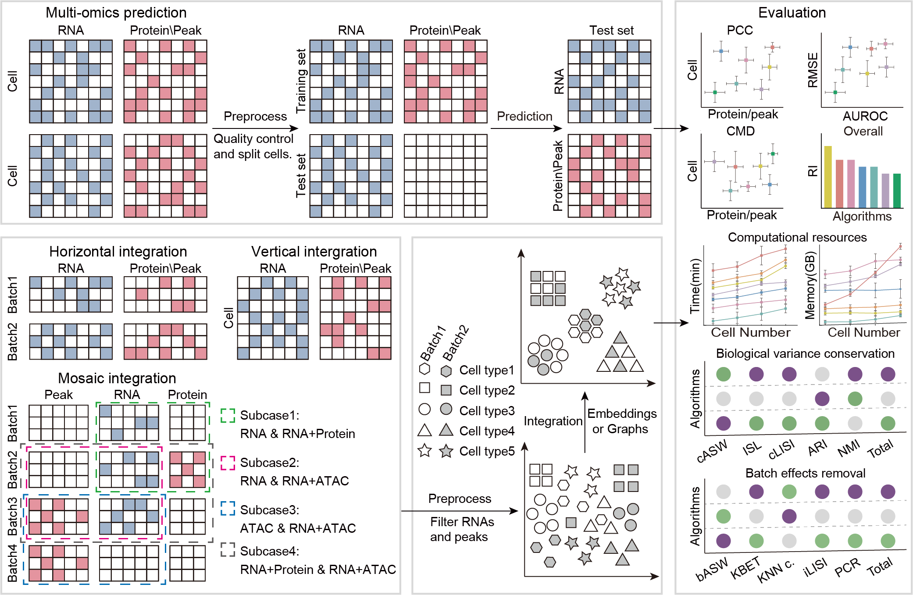

# Benchmarking algorithms for single-cell multi-omics prediction and integration

## Implementation description

  We collected twenty-five RNA+Protein multi-omics datasets generated by CITE-seq and REAP-seq, twelve RNA+ATAC multi-omics datasets generated by 5 single-cell multi-omics sequencing technologies (10x Multiome, SNARE-seq, SHARE-seq, and ISSAAC-seq), and three RNA+ATAC+Protein single-cell multi-omics dataset obtained by DOGMA-seq and TEA-seq to 
  1) systematically evaluate the performance of 14 algorithms for predicting protein abundance or chromatin accessibility from using gene expression;
  2) and systematically evaluate the performance of 18 multi-omics integration algorithms designed for vertical, horizontal, or mosaic integration using 35 datasets (with cell type labels) and ten evaluation metrics. 
  3) We also compared the performance of these prediction algorithms using different batches, cells, and genes of data for training and prediction.
  4) Finally, we evaluate the computational resources consumed by each algorithm.

  We provide example guidance to help researchers choose an appropriate algorithm for their datasets.The code files located in 'Prediction/RNA_Protein/pipeline' and 'Prediction/RNA_ATAC/pipeline' are examples showing how to use them to predict protein abundance or chromatin accessibility from gene expression. And the code files located in 'Integration/pipeline' are examples showing how to use these integration algorithms.

## Dependencies and requirements for single-cell multi-omics prediction and integration

 Before you run the pipeline, for prediction please make sure that you have installed and python3, R(4.1) and all the 14 packages(totalVI, scArches, cTP-net, scVAEIT, BABEL, CMAE, sciPENN, Guanlab-dengkw, scMoGNN, MultiVI, LS_Lab, scMOG, Seurat and LIGER).
 For integration please make sure that you have installed and python3, R(4.1) and all the 18 packages(Seurat, MOJITOO, totalVI, Multigrate, SCOIT, scArches, scVAEIT, CiteFuse, DeepMAPS, scAI, MultiVI, MOFA+, scMVP, MIRA, Schema, UINMF, scMoMaT, StabMap) :
1. Before the installation of these packages, please install Miniconda to manage all needed software and dependencies. You can download Miniconda from https://conda.io/miniconda.html.
2. Download MultiomeBenchmarking.zip from https://github.com/QuKunLab/MultiomeBenchmarking. Unzipping the package and you will see env, in which there are Integration and Prediction folders, as well as the "*.yml" files located in their respective folders. Below is an example of how to build the environment:
#### Building prediction environment for totalVI, scArches, LS_Lab:
   1. Build isolated environment for totalVI, scArches and LS_Lab algorithms : 
   `conda env create -f scvi.yml`
   2. Activate python environment: 
   `conda activate scvi`

Installation of Benchmarking may take about 7-15 minutes to install the dependencies.

### Prediction
#### Predicting protein abundance of cells in scRNA-seq

1. Dependencies and requirements

    Before you run the pipeline, please make sure that you have installed and python3, R and all the eleven packages: totalVI(Version 0.17.4), scArches(Version 0.5.4), cTP-net(Version 0.2.4), BABEL(Version 1.0.0rc0), CMAE(Version 1.0.0rc0), sciPENN(Version 0.9.6), Guanlab-dengkw, scMoGNN(Version 1.0.0rc0), Seurat(Version 4.1.1), LIGER(Version 1.0.0),  scVAEIT(Version 0.0.0)
 
   The package has been tested on Linux system (CentOS) and should work in any valid python environment. 

2. Tutorial

   If you want to analysis your own data, the [Prediction/RNA_Protein/pipeline](code/Prediction/RNA_Protein/pipeline) are example showing how to use them to predict protein abundance of cells.
  
#### Predicting chromatin accessibility information of cells in scRNA-seq

1.  Dependencies and requirements

    Before you run the pipeline, please make sure that you have installed and python3, R and all the nine packages:BABEL(Version 1.0.0rc0), CMAE(Version 1.0.0rc0), MultiVi(Version 0.20.3), LS_Lab, scMoGNN(Version 1.0.0rc0), Seurat(Version 4.1.1) and LIGER(Version 1.0.0), scMOG and scVAEIT(Version 0.0.0).
 
    The package has been tested on Linux system (CentOS) and should work in any valid python environment. 

2. Tutorial

   If you want to analysis your own data, the [Prediction/RNA_ATAC/pipeline](code/Prediction/RNA_ATAC/pipeline) are examples showing how to use them to predict chromatin accessibility information of cells.

### Integration
#### Vertical integration

1.  Dependencies and requirements

    Before you run the pipeline, please make sure that you have installed and python3, R and all the fifteen packages:totalVI(Version 0.19.0), scAI(Version 1.0.0), MOFA+(Version 0.7.0), Seurat(Version 4.3.0.1), scArches(Version 0.5.9), CiteFuse(Version 1.10.0), SCOIT(Version 0.1.1), MOJITOO(Version 1.0), MultiVI(Version 0.19.0), DeepMAPS(Version 1.16.0), Schema(Version 0.1.5.5), MIRA(Version 2.1.0), scMVP(Version 0.0.1), scVAEIT(Version 0.0.0), Multigrate(Version 0.0.2).
 
    The package has been tested on Linux system (CentOS) and should work in any valid python environment. 

2. Tutorial

   If you want to analysis your own data, the [Integration/pipeline/Vertical](code/Integration/pipeline/Vertical) are examples showing how to use them to predict chromatin accessibility information of cells.

#### Horizontal integration

1.  Dependencies and requirements

    Before you run the pipeline, please make sure that you have installed and python3, R and all the nine packages:totalVI(Version 0.19.0), MOFA+(Version 0.7.0), scArches(Version 0.5.9), MultiVI(Version 0.19.0), MIRA(Version 2.1.0), scVAEIT(Version 0.0.0), Multigrate(Version 0.0.2), UINMF(Version 1.0.1), scMoMaT(Version 0.2.2).
 
    The package has been tested on Linux system (CentOS) and should work in any valid python environment. 

2. Tutorial

   If you want to analysis your own data, the [Integration/pipeline/Horizontal](code/Integration/pipeline/Horizontal) are examples showing how to use them to predict chromatin accessibility information of cells.

#### Mosaic integration

1.  Dependencies and requirements

    Before you run the pipeline, please make sure that you have installed and python3, R and all the eight packages:totalVI(Version 0.19.0), scArches(Version 0.5.9), MultiVI(Version 0.19.0), scVAEIT(Version 0.0.0), Multigrate(Version 0.0.2), UINMF(Version 1.0.1), scMoMaT(Version 0.2.2), StabMap(Version 0.1.8).
 
    The package has been tested on Linux system (CentOS) and should work in any valid python environment. 

2. Tutorial

   If you want to analysis your own data, the [Integration/pipeline/Mosaic](code/Integration/pipeline/Mosaic) are examples showing how to use them to predict chromatin accessibility information of cells.

__Datasets__

  All datasets used are publicly available data, for convenience datasets can be downloaded from: https://mailustceducn-my.sharepoint.com/:f:/g/personal/hyl2016_mail_ustc_edu_cn/EgYFP7tlTKBBuAhkdtrIOg4B1Eyo-_iBx1VKBWSK0r-9rA?e=gmhocx.

__Tips__

  If you encounter difficulties downloading our code from GitHub, we recommend downloading it from Zenodo: https://zenodo.org/records/10540843

<!--For citation and further information please refer to: __Li, B., Zhang, W., Guo, C. et al. Benchmarking spatial and single-cell transcriptomics integration methods for transcript distribution prediction and cell type deconvolution. Nat Methods (2022). https://doi.org/10.1038/s41592-022-01480-9__.-->

